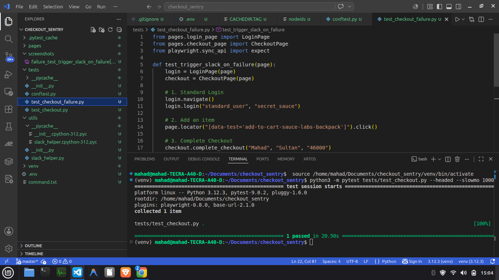
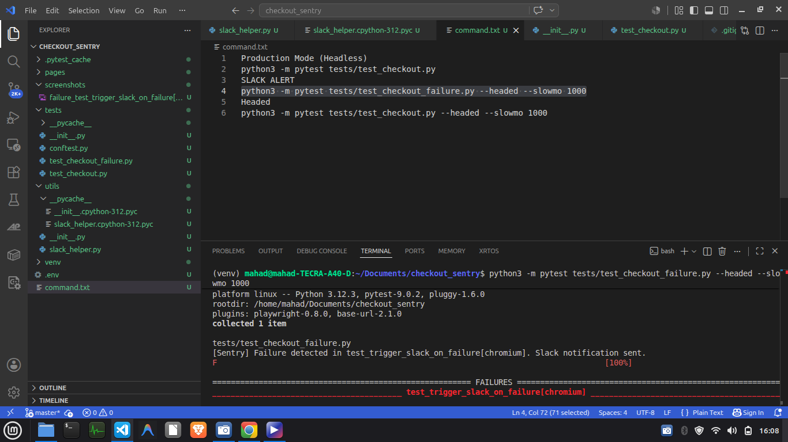
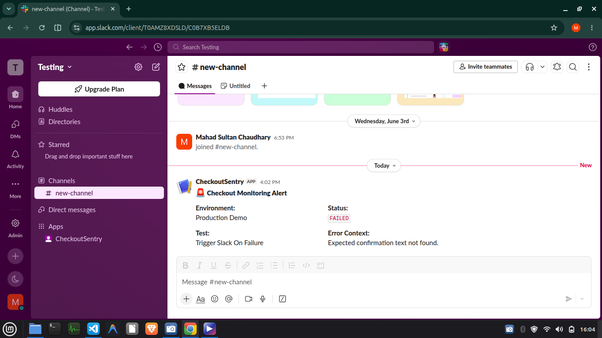

# Checkout Sentry 🚨

A production-focused automated testing and monitoring framework built with **Python**, **Playwright**, and **Pytest**.

The framework continuously validates a critical e-commerce checkout workflow using the **Page Object Model (POM)** design pattern. When a failure occurs, it automatically captures screenshots and dispatches structured Slack notifications, enabling faster debugging and incident response.

---

# 📊 Visual Demonstration & Proof of Concept

## 1. Successful E2E Run (Headed Execution)

The framework successfully completes the entire customer journey:

* User authentication
* Product selection
* Cart validation
* Checkout completion
* Order confirmation verification

 

---

## 2. Failure Detection & Interception

To demonstrate failure handling, an assertion is intentionally modified. Pytest immediately detects the failure, stops execution, and triggers the monitoring workflow.



---

---

## 3. Real-Time Slack Alerting

When a test fails, the framework automatically sends a structured Slack notification containing failure metadata and debugging information. This simulates how production monitoring systems notify engineering teams about regressions and broken user flows.



---


---

# ✨ Features

* Automated end-to-end checkout testing
* Playwright browser automation
* Pytest-based test execution
* Page Object Model (POM) architecture
* Automatic screenshot capture on failures
* Slack alert integration
* Headless and headed execution modes
* Centralized fixtures and test hooks
* Maintainable and scalable project structure

---

# 🏗️ Project Structure

```text
checkout_sentry/
├── media/
│   ├── passing_test.png
│   ├── failing_test.png
│   └── slack_alert.png
├── pages/
│   ├── login_page.py
│   └── checkout_page.py
├── tests/
│   ├── conftest.py
│   ├── test_checkout.py
│   └── test_checkout_failure.py
├── utils/
│   └── slack_helper.py
├── .gitignore
├── pytest.ini
└── README.md
```

---

# 🧩 Architecture

## Page Object Model (POM)

UI locators and page interactions are encapsulated inside page classes.

This keeps test cases focused on business logic and assertions while improving maintainability and reducing duplication.

---

## Failure Monitoring Workflow

```text
Test Execution
      │
      ▼
Assertion Failure
      │
      ▼
Pytest Hook Triggered
      │
      ├── Capture Screenshot
      ├── Collect Failure Details
      └── Send Slack Notification
      │
      ▼
Engineering Team Alerted
```

---

## Failure Handling

Custom Pytest hooks automatically intercept failed test executions and perform the following actions:

* Capture a screenshot of the browser state
* Collect failure context and stack trace information
* Generate debugging artifacts
* Send a structured Slack notification

This approach keeps successful runs lightweight while providing detailed diagnostics when failures occur.

---

## Slack Integration

Failed executions generate automated Slack alerts containing:

* Test name
* Failure status
* Screenshot location
* Failure details
* Execution context

This mirrors the monitoring workflows commonly used by QA, SDET, and DevOps teams.

---

# 🚀 Installation

## Clone Repository

```bash
git clone https://github.com/mahadsultanchaudhary/checkout_sentry.git
cd checkout_sentry
```

## Create Virtual Environment

```bash
python -m venv venv

# Linux / macOS
source venv/bin/activate

# Windows
venv\Scripts\activate
```

## Install Dependencies

```bash
pip install playwright pytest pytest-playwright requests python-dotenv

playwright install chromium
```

---

# 🔐 Environment Variables

Create a `.env` file in the project root:

```env
SLACK_WEBHOOK_URL=https://hooks.slack.com/services/YOUR/WEBHOOK/URL
```

The `.env` file is excluded from version control through `.gitignore`.

---

# ▶️ Running Tests

## Successful Checkout Flow

```bash
pytest tests/test_checkout.py --headed --slowmo 1000
```

## Failure Demonstration (Triggers Slack Alert)

```bash
pytest tests/test_checkout_failure.py --headed --slowmo 1000
```

## Headless Monitoring Mode

```bash
pytest tests/test_checkout.py
```

Ideal for CI/CD pipelines and scheduled monitoring jobs.

---

# 🔄 Example Workflow

1. User logs in
2. Product is added to cart
3. Checkout information is entered
4. Order is submitted
5. Confirmation message is validated

If any step fails:

* Screenshot is captured
* Failure context is collected
* Slack notification is sent automatically
* Engineering team is alerted

---

# 🛠️ Tech Stack

* Python
* Playwright
* Pytest
* Requests
* Python Dotenv
* Slack Webhooks

---

# 📈 Future Improvements

* GitHub Actions CI/CD integration
* Allure reporting
* Parallel test execution
* Multi-browser support
* Scheduled monitoring runs
* Historical failure tracking
* Dashboard-based reporting

---

# 🎯 Why This Project?

This project demonstrates practical skills commonly required in QA Automation and SDET roles:

* End-to-end test automation
* Test framework design
* Page Object Model implementation
* Failure handling and debugging
* Monitoring and alerting systems
* Maintainable automation architecture
* Third-party service integrations

Rather than simply validating UI functionality, the framework showcases how automated tests can be transformed into an active monitoring and notification system for critical user journeys.
